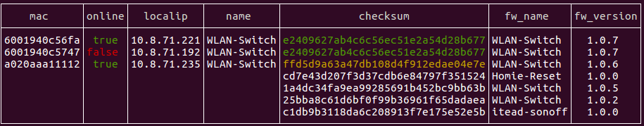

Hodmin - HOmie-aDMIN
======================

Hodmin is a tool to administrate Homie-devices (IOT, esp8266-based microcomputers with Homie-firmware: [Homie])

Hodmin enables you to administrate your Homie-devices via command-line-interface (CLI). It consists of some scripts to wrap homie-administration in some handy commands. If needed, these commands can be used within your own scripts, so interaction with Homie-devices is very flexible. Hodmin does not communicate with a homie-device directly. It instead uses your MQTT-broker to pull / push informations from / to a device.

## Example

List devices seen in my network and available firmwares in my Arduino-sketchbook of my workstation:

*hodmin list*



Left part of first three lines show us our devices with Homie-name. Column *checksum* shows md5 of installed firmware. Right part of table shows all Homie-firmwares found in sketchbook-directory. If a firmware is listed in same row as a device, this firmware is running on this device. If checksum is shown in green color, the latest firmware of this firmware-name is running. The third line in example above is yellow, so there is a new firmware available in our sketchbook to install.

If we like to update our 'yellow' device, we just use this command:

`hodmin -m a02* pushFW -c e240*`

Option -m specifies MAC-address of our device. Because there is only one device starting with *a02*, there is no need to type all chars of MAC. We use * instead. After subcommand *pushFW* we need to specify firmware-file to be uploaded to our device. In this example we do it by option -c for checksum and use * also.

Starting this command will send our binaryfile *Over the Air (OTA)* to our device. More examples are provided down below and refer to this screenshot.

All this stuff is homie-functionality, but Hodmin wraps it in some handy commands. In my point of view work with homie is more comfortable using Hodmin.


## Install

Install with `gem install hodmin`. After installation start with command `hodmin list`. This will put a default config-file in ~/.hodmin.yaml. Open this file with any editor and fill in your MQTT-credentials.

## System prerequisites

Hodmin ist a bundle of scripts written in [Ruby][ruby]. You need a running Ruby-Installation (tested: 2.0.0 and above), most modern operating systems include one (Debian-based systems: `apt-get install ruby-full` or use RVM[RVM]). Hodmin ist developed and tested under Linux - it should run under MAC OS/X and -maybe - Windows too - but I didn' t test it until now.

## Subcommands

Every Hodmin command starts with `hodmin` optional followed by a device-description to select one or some homie-devices. Next part is a subcommand, which describes desired action, optional followed by more options describing firmware used in this action.
In every command and every subcommand you can use *-h* to see short help info about using a command.

*Remark*: Firmware-name in Homie is defined by using *magic-bytes* in sourcecode of your application. It is by no means connected with filename of binary-file. Same applies to firmware-version. If you do not use this *magic-bytes* in your sketch, Hodmin will not identify this firmware. See Homie-documentation for details.

### list: list all or some of devices and all or some of firmwares found in your sketchbook (or any other directory tree you specified)

This commands searches your MQTT-broker for Homie-devices (identfied by tree *devices/homie* in default config). It also searches your directory-tree for Homie-firmware (identfied by *magic-bytes*). So to work with Hodmin you should always compile your Homie-Firmware and save it on disk (Arduino: export bin-file).

- Options before *list* subcommand: 
  - -m, --mac=\<s>: select device(s) by mac. You can use *\<pattern>** or **\<pattern>* whatever fits better to your MAC-addresses (i.e. *3f2 to pick up the MAC ending with this chars).
  - -f, --fw-name=\<s>: select device(s) by firmware-name. You can specify a complete firmware-name or you can use -<pattern*-style as above (i.e. WLAN*).
  - -c, --checksum=\<s>: select device(s) by actual firmware-checksum (Homie uses MD5). Use -<pattern>*- to type only some chars of md5 (ie. 3ac*).
  - -l, --localip=\<s>: select device(s) by actual ip4-address. Use -<pattern>*- if you want to pick up more than one device (i.e. 10.100.30.3* or '*.30.*').
  - -o, --configfile=\<s>: use this configfile instead of default (default: ~/.Hodmin.yaml). Perhaps you have a different MQTT-Server for testing: with option *-o testing.yaml* you start Hodmin with different config.

- Options after *list* subcommand
  - -f, --fw-name=\<s>: Select firmware(s) by firmware-name. See above.
  - -c, --checksum=\<s>: Select firmware(s) by firmware-checksum. See above.
  - -s, --style=\<s>: Output table style: unicode, ascii or basic. Default output of list is a nice table. But if you use this command in a batch-file, it might be better to omit special chars. With *ascii* or *basic* table will look different. Usually *basic* is best deal if you want to parse list-output with bash-commands.
  - -n, --nil=\<s>: Text to be printed in table in case of NIL-value. In case of nil-value every cell of list-output is filled with this char. If you need to find n-th column, just count white-spaces in list-output.

### pullCF:		pull config-data from device

This subcommand pulls config-data from a Homie-device and shows it on screen.  Use it as config-backup and boilerplate for changing config. This command does not read directly from a Homie-device, instead it reads your MQTT-broker to collect all config-info. So this command is available even if your device is offline.

- Options after *pullCF* subcommand
  - -o, --outputfile=\<s>: Give this option if you wish to save config-data in a file. Default filename ist *Homie-\<MAC-address>.yaml* (if you only give -o). If you add a filename after -o, this file will be used to save data.
  
			 Example:
				 - hodmin -m *747 pullCF # will create a file *Homie-6001940c5747.yaml* in your working directory.

### pushCF:		push config-data to device

This subcommand pushes config-data to a Homie-device (to be exact: to MQTT-broker). It reads from YAML-file (see above).

- Options after *pushCF* subcommand
  - -j, --jsonconfig=\<s>: JSON-formatted string with config-option(s) to change. Using this option you can send a JSON-formated part of config-data. Example: `hodmin -m *747 pushCF -j '{"ota": {"enabled":false}}'` will turn off OTA-mode.
  - -i, --inputfile=\<s>: Read new config-options from yaml-file: Easy way to change config: pullCF from a device into file, change file as desired and pushCF whole config-file back to device.
  - -s, --shortconfig=\<s>: Fast changing of some config-options. Possible for setting: name:xy ota:on|off ssid:xy wifipw:xy host:xy port:xy
                           base_topic:xy auth:on|off user:xy mqttpw:xy. Enclose multiple options in "", separate options with a
                           blank. Arguments (i.e. passwords) must NOT include blanks or colons. If you need these characters, use
                           option -j or -i.
                           
			 Examples:
				 - hodmin -m *112 pushCF -s mqttpw:'abc'    # change config for this device
				 - hodmin -m *112 pushCF -s "ota:off mqttpw:abc auth:true"  # change multiple config for this device
				 - hodmin -f WLAN* pushCF -s "ota:off mqttpw:abc auth:true"  # change multiple config for all devices running firmware 'WLAN*'
                           
### pushFW:		push firmware-file to device (OTA: Over-The-Air, WIFI)

This subcommand pushes binary firmware-file to a Homie-device.

- Options after *pushFW* subcommand
  - -f, --fw-name=\<s>     Select firmware-file by firmware-name.
  - -c, --checksum=\<s>    Select ONE firmware-files by firmware-checksum. Use exactly this firmware.
  - -u, --upgrade         Select newest firmware-file by firmware-name of Homie-device. 
  - -a, --auto            Upgrade in batch mode - do not ask for updating a device (be carefull using this option). If you use Hodmin within cron-scripts, this option might be usefull.

			 Examples:
				 - hodmin -m *747 pushFW -c 25* # will bring firmware-version 1.0.2 to device 6001940c5747 (see screenshot above).
				 - hodmin -m *747 pushFW -f WLAN* -u -a # will update this device without any further question.

### rename:		rename firmware-file

This subcommand searches in your firmware-directory for Homie-firmware-files. Every filename not already in Hodmin-style is offered to rename. Hodmin-style: "Homie\_\<Firmware-name>_\<Firmware-version>_\<Firmware-checksum>.bin" is unique. If you rename a binary after compiling, this version will stay on disk, even if you recompile a later version.

- Options after *rename* subcommand
  - -f, --fw-name=\<s>     Select firmware-file by firmware-name.
  - -c, --checksum=\<s>    Select ONE firmware-files by firmware-checksum. Use exactly this firmware.

### remove:		remove firmware-file

This subcommand searches in your firmware-directory for Homie-firmware-files. Every filename matching your pattern is offered to be removed.

- Options after *remove* subcommand
  - -f, --fw-name=\<s>     Select firmware-file by firmware-name.
  - -c, --checksum=\<s>    Select ONE firmware-files by firmware-checksum. Use exactly this firmware.

### initialize:		initialize Homie-device after first flashing of Firmware via USB. Uses WIFI-AP of Device. **EXPERIMENTAL!**

This subcommand is usefull only for the first step in setting up a Homie-device. After firmware is sent to a device for the first time (or reset) via USB, it spans a AP which is used to get config-data. Plug your workstation into this wifi-network and start initiate. This command tries to send a config file to IP 192.168.123.1. Basically it wraps only one bash-command: `curl -X PUT http://192.168.123.1/config -d @\<filename> --header 'Content-Type: application/json'. *Remark:* It uses *curl*, this program must be available on your system. 

- Options after *initialize* subcommand
  - -c, --configfile=\<s>:    Push initiating config-options from file to new device (default: homie-initialize.yaml)

## Hodmin-config-file

During startup Hodmin checks existence of file *~/.hodmin.yaml*. If it is found, Hodmin reads its configuration. Otherwise Hodmin creates this file and writes a default config into it. Edit this file before starting Hodmin next time.

```YAML

mqtt:
  protocol: mqtt://
  host: mqtt.example.net
  port: '1883'
  auth: true
  user: '<username>'
  password: '<password>'
  base_topic: 'devices/homie/'
  timeout: '0.3'
firmware:
  dir: '/home/<username>/sketchbook/'
  filepattern: '*.bin'
logging:
  # STDOUT OR nil OR filename
  logdestination: nil
output:
  list: 'HD.mac HD.online HD.localip HD.name FW.checksum FW.fw_name FW.fw_version'
  nil:   # Text to be shown in table in case of NIL-value

```

- Additional info regarding some lines of config-file above:
  - **mqtt:** if *auth* is false, username and password are ignored. *timeout* sets a time (in seconds) that Hodmin-mqtt-client will wait during reading all topics of your Homie-devices. 0.3 secs should be fairly enough for a lot of devices. If you have trouble getting infos about all topics, play around with this value.
  - **firmware:** Within this *dir*ectory Hodmin will search for all binary-files matching your given *filepattern*. Only files including *Homie-magic-bytes* will be selected by Hodmin.
  - **logging:** *STDOUT* will report all logging-output to console, *nil* will suppress logging, *'filename'* will report logging-output into this file in your working directory.
  - **output:** *list* defines which items will be shown with list-subcommand. *HD* means properties of Homie-devices, *FW* means properties of firmwares. Change it accoording to your needs. *nil* defines output in case of empty cells. If you need to parse the output table, it is easier to set nil to (example) '-'. This way every column has a value. 
  
-------

Hodmin is a tool to administrate Homie-Devices.
Copyright (C) 2017 Thomas Romeyke (rttools at gmail.com).

This program is free software: you can redistribute it and/or modify
it under the terms of the GNU General Public License as published by
the Free Software Foundation, either version 3 of the License, or
any later version.

This program is distributed in the hope that it will be useful,
but WITHOUT ANY WARRANTY; without even the implied warranty of
MERCHANTABILITY or FITNESS FOR A PARTICULAR PURPOSE.  See the
GNU General Public License for more details.

You should have received a copy of the GNU General Public License
along with this program.  If not, see <http://www.gnu.org/licenses/>.
    
[ruby]: http://www.ruby-lang.org
[Homie]: https://github.com/marvinroger/Homie
[RVM]: https://rvm.io/
